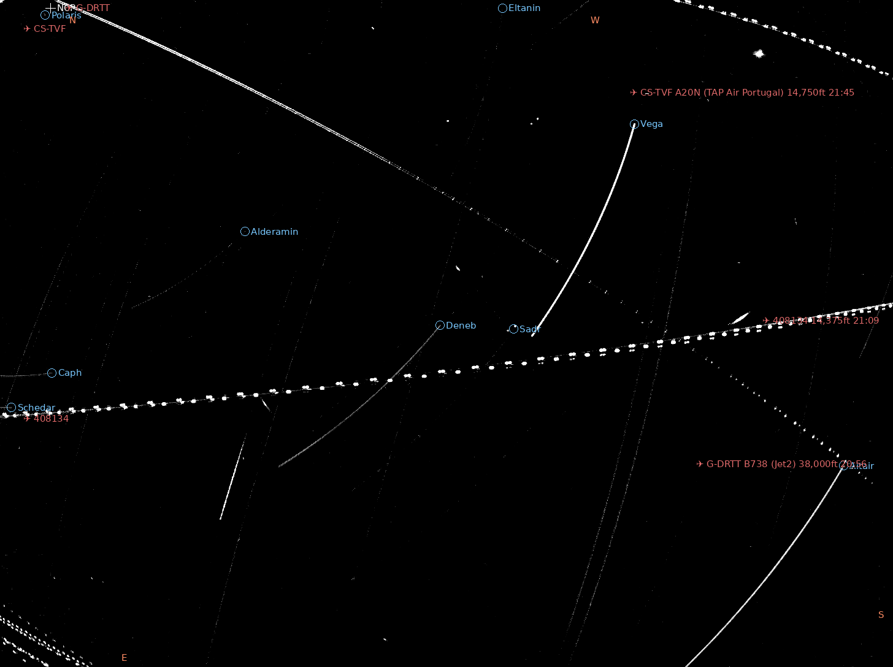
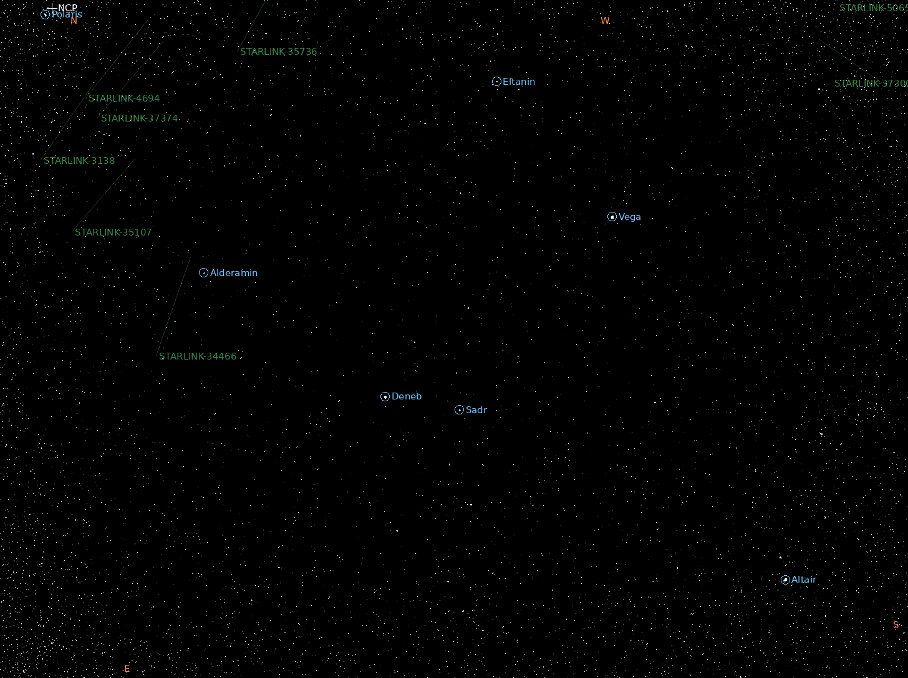
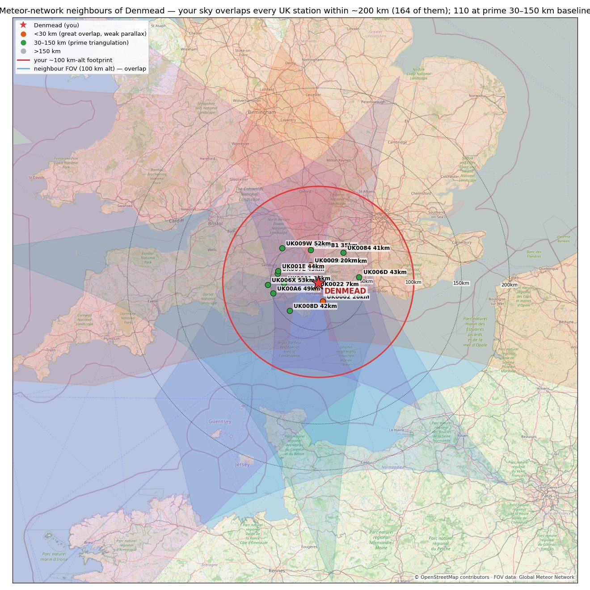

# rms-web

A tiny, read-only **LAN web dashboard for an [RMS](https://github.com/CroatianMeteorNetwork/RMS) /
[Global Meteor Network](https://globalmeteornetwork.org/) meteor-camera station**, plus a
**"neighbours" map** showing nearby stations and where their fields of view overlap yours.


*The **/tonight** page's live cumulative stack of the night so far — star trails, satellites and
aircraft — annotated in real time through the station's own astrometric calibration (platepar):
bright-star labels ride the trail heads, with the celestial pole, cardinal directions and (when
up) the Moon, planets and ecliptic. If a label drifts off its star, your astrometry has shifted —
the overlay doubles as a free calibration monitor.*

RMS itself has no local web UI — you review the night with desktop tools or wait for the GMN
site. This fills that gap: point a browser at the Pi and browse last night's stacks, detections,
timelapses and reports, watch tonight's capture build in real time, jump to the live camera, and
see your place in the network.

No framework, three pieces:

- **`rms_web.py`** — a single-file HTTP server (Python **standard library only**). Serves the
  contents of `RMS_data/` as a browsable dashboard: nightly captured stacks, detection
  thumbnails, timelapses and observation reports, a live-view link (MediaMTX WebRTC), and the
  neighbours page. Read-only, GET-only, path-sanitised (no directory traversal).
- **`make_tonight_preview.py`** — a small daemon behind the **/tonight** page: incrementally
  stacks tonight's FF files as they are written and renders the latest-sky and cumulative-stack
  previews. Its overlay modules annotate each render through the live platepar:
  - `sky_overlay.py` — bright stars (IAU names), Moon + planets (pyephem), ecliptic, north
    celestial pole and N/E/S/W, all projected with `RMS.Astrometry` so labels land exactly where
    the calibration says they should;
  - `sat_overlay.py` — sunlit satellite passes (CelesTrak TLEs, ~11k incl. Starlink, SGP4 via
    pyephem) drawn as faint streaks and logged to a pass table;
  - `adsb_overlay.py` — near-overhead aircraft from live ADS-B ([adsb.fi](https://adsb.fi)),
    dead-reckoned to the frame time, labelled with callsign + altitude and logged.

  Together with the page's live per-FF detection counts, every streak in the stack is
  accounted for: **matches a satellite pass → satellite; matches an aircraft pass → aircraft;
  neither → meteor candidate.**
- **`make_neighbours_map.py`** — renders `neighbours_map.png` + `neighbours.json`: an
  OpenStreetMap basemap with your camera's ~100 km-altitude footprint, nearby GMN stations
  (classified by triangulation baseline), and a few real GMN 100 km field-of-view polygons so
  the sky overlap is visible. `--refresh` re-pulls the live station list from GMN first.

## Screenshots

**Latest sky (~10 s)** — one FF block, annotated live; predicted satellite streaks are drawn
faint so the sky stays legible:



**Neighbours** — your triangulation partners and where their 100 km fields of view overlap
yours (each station links to its GMN weblog):



## Requirements

- **Server:** Python 3.9+ — no third-party packages.
- **Neighbours map:** `matplotlib`, `pillow` (`pip install -r requirements.txt`).
- **Tonight preview + overlays:** run inside your RMS virtualenv (needs `RMS`, `numpy`,
  `pillow`, `pyephem`). Optional — the dashboard works without them.
- Internet access (for the neighbours map only: OSM tiles + GMN KML). Tiles are cached in
  `osm_cache/`.

## Run

```bash
# dashboard (defaults: serves /mnt/nvme/RMS_data on :8080)
RMS_DATA=/mnt/nvme/RMS_data RMS_WEB_PORT=8080 python3 rms_web.py

# generate the neighbours map — position comes from your RMS .config
# (or set STATION_LAT / STATION_LON / STATION_NAME explicitly)
RMS_CONFIG=~/source/RMS/.config python3 make_neighbours_map.py --refresh
```

Then open `http://<host>:8080/`.

### Configuration (environment variables)

| Variable | Default | Used by |
|---|---|---|
| `RMS_DATA` | `/mnt/nvme/RMS_data` | server — path to RMS data dir |
| `RMS_WEB_PORT` | `8080` | server — listen port |
| `STATION_LAT` / `STATION_LON` | from RMS `.config` | map — your camera position (no default) |
| `STATION_NAME` | station code from RMS `.config` | map + header label |
| `RMS_CONFIG` | `~/source/RMS/.config` | fallback source for position/station code |
| `STATION_FOOTPRINT_KM` | `100` | map — approx ground radius covered at 100 km altitude |

## Deploy (systemd)

Example units in [`deploy/`](deploy/) (adjust the `User=` and the `/home/ian/...` paths for your
system):

- `rms-web.service` — runs the dashboard, `Restart=always`.
- `rms-neighbours-refresh.service` + `.timer` — regenerates the neighbours map weekly (so
  newly-joined stations appear).

```bash
sudo cp deploy/*.service deploy/*.timer /etc/systemd/system/
sudo systemctl daemon-reload
sudo systemctl enable --now rms-web.service rms-neighbours-refresh.timer
```

## Security

LAN use only — there is **no authentication**. It is read-only and only serves image/text/mp4
files from within the data dir, but do not expose it to the public internet.

## Attribution & licence

- Basemap © **OpenStreetMap** contributors (ODbL). Please respect the
  [OSM tile usage policy](https://operations.osmfoundation.org/policies/tiles/).
- Station field-of-view data: **Global Meteor Network** (CC BY 4.0).
- Code: **MIT** — see [LICENSE](LICENSE).
